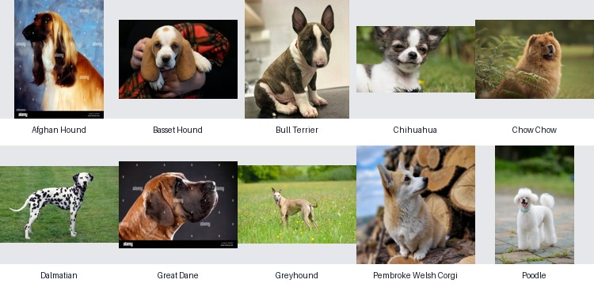

# Phân Loại Giống Chó Bằng MLP-Mixer

Dự án xây dựng hệ thống phân loại giống chó từ ảnh chân dung. Dự án so sánh các mô hình học máy truyền thống với mô hình MLP tự cài đặt và MLP-Mixer, sau đó xây dựng một web app local để dự đoán giống chó từ ảnh bên ngoài.



## Tổng Quan

Bài toán được phát biểu dưới dạng phân loại ảnh có giám sát:

- **Đầu vào:** ảnh chó.
- **Đầu ra:** tên giống chó.
- **Số lớp:** 10 giống chó có ngoại hình tương đối khác nhau.
- **Mô hình chính:** MLP-Mixer, một kiến trúc xử lý ảnh chỉ dùng MLP, không dùng convolution.

Dự án bao gồm các phần:

- Tiền xử lý ảnh thành dữ liệu CSV.
- Huấn luyện và đánh giá nhiều mô hình.
- Tối ưu MLP-Mixer bằng các kỹ thuật huấn luyện hiện đại.
- Lưu checkpoint mô hình tốt nhất.
- Xây dựng web app để upload/kéo-thả/paste ảnh và dự đoán giống chó.

## Các Giống Chó Được Sử Dụng

Preset `diverse10` gồm 10 lớp:

| STT | Giống chó |
|---:|---|
| 1 | Afghan Hound |
| 2 | Basset Hound |
| 3 | Bull Terrier |
| 4 | Chihuahua |
| 5 | Chow Chow |
| 6 | Dalmatian |
| 7 | Great Dane |
| 8 | Greyhound |
| 9 | Pembroke Welsh Corgi |
| 10 | Poodle |

## Kết Quả Thực Nghiệm

Dự án sử dụng **top-1 accuracy** và **top-3 accuracy** để đánh giá mô hình.

- **Top-1 accuracy:** dự đoán có xác suất cao nhất phải đúng với nhãn thật.
- **Top-3 accuracy:** nhãn thật chỉ cần nằm trong 3 dự đoán có xác suất cao nhất.

| Mô hình | Thiết lập tốt nhất | Test Top-1 | Test Top-3 |
|---|---:|---:|---:|
| KNN | `k = 1` | 43.50% | 57.33% |
| Linear SVM | `C = 10` | 40.00% | 64.83% |
| Decision Tree | `max_thresholds = 3` | 30.00% | 50.17% |
| MLP-Mixer | công thức huấn luyện tối ưu | **73.32%** | **86.99%** |

Kết quả validation của checkpoint MLP-Mixer tốt nhất:

| Mô hình | Validation Top-1 | Validation Top-3 |
|---|---:|---:|
| MLP-Mixer | 73.46% | 87.12% |

## Dữ Liệu

Dữ liệu ảnh được thu thập cho 10 giống chó. Sau khi thu thập, dữ liệu được làm sạch bằng cách loại bỏ:

- Ảnh meme.
- Ảnh hoạt hình.
- Ảnh game.
- Ảnh có người hoặc vật thể không liên quan.
- Ảnh phong cảnh lớn, chó quá nhỏ hoặc không rõ chủ thể.

Sau khi lọc, mỗi lớp giữ khoảng 1000 ảnh chân dung/cận mặt chó.

Dataset gốc không được đưa trực tiếp vào repository vì dung lượng lớn.

## Tiền Xử Lý Dữ Liệu

Script [preprocess_images.py](preprocess_images.py) chuyển folder ảnh thành file CSV. Các bước chính:

1. Sửa hướng ảnh theo EXIF.
2. Chuyển ảnh về RGB.
3. Center crop và resize ảnh về hình vuông.
4. Chuyển ảnh thành mảng số.
5. Flatten ảnh thành vector.
6. Chuẩn hóa pixel về khoảng `[0, 1]`.

Cấu trúc dataset đầu vào:

```text
data/merged_dog_dataset_v2/
  Afghan Hound/
    image_001.jpg
  Basset Hound/
    image_001.jpg
  ...
```

Tạo CSV ảnh `64x64x3`:

```bash
python preprocess_images.py \
  --data-dir data/merged_dog_dataset_v2 \
  --output data/dog_dataset_32_new.csv \
  --image-size 64
```

Tạo CSV ảnh `96x96x3` để thử nghiệm độ phân giải cao hơn:

```bash
python preprocess_images.py \
  --data-dir data/merged_dog_dataset_v2 \
  --output data/dog_dataset_96.csv \
  --image-size 96
```

Giới hạn mỗi lớp 1000 ảnh:

```bash
python preprocess_images.py \
  --data-dir data/merged_dog_dataset_v2 \
  --output data/dog_dataset_64_1000_each.csv \
  --image-size 64 \
  --limit-per-class 1000
```

## Mô Hình

Dự án cài đặt và thử nghiệm các mô hình:

- **KNN:** phân loại dựa trên khoảng cách tới các mẫu gần nhất.
- **Linear SVM:** SVM tuyến tính với hinge loss.
- **Decision Tree:** cây quyết định dùng Gini impurity.
- **Original MLP:** MLP tự cài đặt, nhận ảnh đã flatten thành vector.
- **MLP-Mixer:** mô hình MLP xử lý ảnh theo patch, giữ được một phần cấu trúc không gian của ảnh.

## MLP-Mixer

MLP-Mixer chia ảnh thành các patch nhỏ. Mỗi patch được xem như một token. Mỗi Mixer block gồm hai phần:

- **Token-mixing MLP:** trộn thông tin giữa các patch khác nhau, giúp mô hình học quan hệ không gian toàn ảnh.
- **Channel-mixing MLP:** trộn thông tin giữa các đặc trưng bên trong từng patch.

Phiên bản MLP-Mixer tốt nhất trong dự án sử dụng thêm:

- LayerNorm trong patch projection.
- Positional embedding.
- Residual connection.
- Learned token pooling.
- DropPath và LayerScale.
- AdamW với parameter groups không decay bias/norm.
- Warmup learning rate và cosine decay.
- Gradient clipping.
- EMA model.
- Mixup.
- Spatial augmentation: random crop, horizontal flip, random erasing.

## Cấu Trúc Dự Án

```text
.
├── class_presets.py
├── data_utils.py
├── metrics.py
├── preprocess_images.py
├── merge_dog_datasets.py
├── train.py
├── train_library_mlp.py
├── train_knn.py
├── train_svm.py
├── train_decision_tree.py
├── predict_app.py
├── model/
│   ├── base.py
│   ├── knn.py
│   ├── svm.py
│   ├── decision_tree.py
│   └── mlp.py
├── scripts/
│   └── export_app_bundle.py
└── docs/
    ├── APP.md
    ├── DATASET.md
    ├── GITHUB.md
    ├── TRAINING.md
    ├── report.pdf
    └── assets/
        └── dog_breed_samples.jpg
```

Tài liệu phụ:

- [Hướng dẫn dữ liệu](docs/DATASET.md)
- [Hướng dẫn huấn luyện](docs/TRAINING.md)
- [Hướng dẫn chạy web app](docs/APP.md)

## Cài Đặt Môi Trường

```bash
conda create -n dog python=3.11
conda activate dog
pip install -r requirements.txt
```

Nếu dùng GPU, cần cài bản PyTorch CUDA phù hợp với driver NVIDIA:

```text
https://pytorch.org/get-started/locally/
```

## Huấn Luyện MLP-Mixer Tốt Nhất

```bash
python train.py \
  --model mlp \
  --mlp-type mixer \
  --optimizer adamw \
  --data-path data/dog_dataset_32_new.csv \
  --class-preset diverse10 \
  --device cuda \
  --no-scaler \
  --epochs 200 \
  --patience 40 \
  --warmup-epochs 10 \
  --batch-size 128 \
  --hidden-size 256 \
  --depth 8 \
  --patch-size 4 \
  --token-mlp-size 256 \
  --channel-mlp-size 1024 \
  --learning-rate 5e-4 \
  --weight-decay 1e-4 \
  --dropout 0.1 \
  --label-smoothing 0.05 \
  --feature-noise 0.005 \
  --feature-drop 0.01 \
  --ema-decay 0.99 \
  --mixup-alpha 0.1 \
  --grad-clip 1.0 \
  --drop-path 0.05 \
  --layer-scale 0.1 \
  --crop-padding 4 \
  --hflip-prob 0.5 \
  --erase-prob 0.25 \
  --erase-scale 0.18 \
  --checkpoint checkpoint/mlp_mixer_diverse10_best.pt
```

## Huấn Luyện Các Mô Hình Khác

MLP nguyên bản:

```bash
python train.py \
  --model mlp \
  --mlp-type original \
  --data-path data/dog_dataset_32_new.csv \
  --class-preset diverse10 \
  --device cuda \
  --no-scaler
```

KNN:

```bash
python train_knn.py \
  --data-path data/dog_dataset_32_new.csv \
  --class-preset diverse10 \
  --device cuda \
  --no-scaler
```

SVM:

```bash
python train_svm.py \
  --data-path data/dog_dataset_32_new.csv \
  --class-preset diverse10 \
  --device cuda \
  --no-scaler
```

Decision Tree:

```bash
python train_decision_tree.py \
  --data-path data/dog_dataset_32_new.csv \
  --class-preset diverse10 \
  --pca-components 100
```

## Web App Dự Đoán

Sau khi có checkpoint, chạy app:

```bash
python predict_app.py \
  --checkpoint checkpoint/mlp_mixer_diverse10_best.pt \
  --device cuda \
  --sample-data-dir data/merged_dog_dataset_v2 \
  --host 127.0.0.1 \
  --port 8000
```

Mở trình duyệt:

```text
http://127.0.0.1:8000
```

App hỗ trợ:

- Chọn ảnh từ máy.
- Kéo-thả ảnh vào khung.
- Paste ảnh bằng `Ctrl+V`.
- Hiển thị top-k nhãn dự đoán.
- Hiển thị xác suất, ảnh mẫu và link thông tin giống chó.

## Xuất App Độc Lập

Tạo folder app nhỏ để copy sang máy khác:

```bash
python scripts/export_app_bundle.py \
  --output-dir dog_mlp_app_bundle \
  --checkpoint checkpoint/mlp_mixer_diverse10_best.pt \
  --label-file artifacts/selected_classes.txt \
  --sample-data-dir data/merged_dog_dataset_v2
```

Folder này chỉ cần code inference, checkpoint, label file và một số ảnh mẫu; không cần toàn bộ dataset train.

## Tài Liệu Tham Khảo

- Tolstikhin, I. O., et al. "MLP-Mixer: An all-MLP Architecture for Vision." NeurIPS, 2021.
- Loshchilov, I., and Hutter, F. "Decoupled Weight Decay Regularization." arXiv:1711.05101, 2017.
